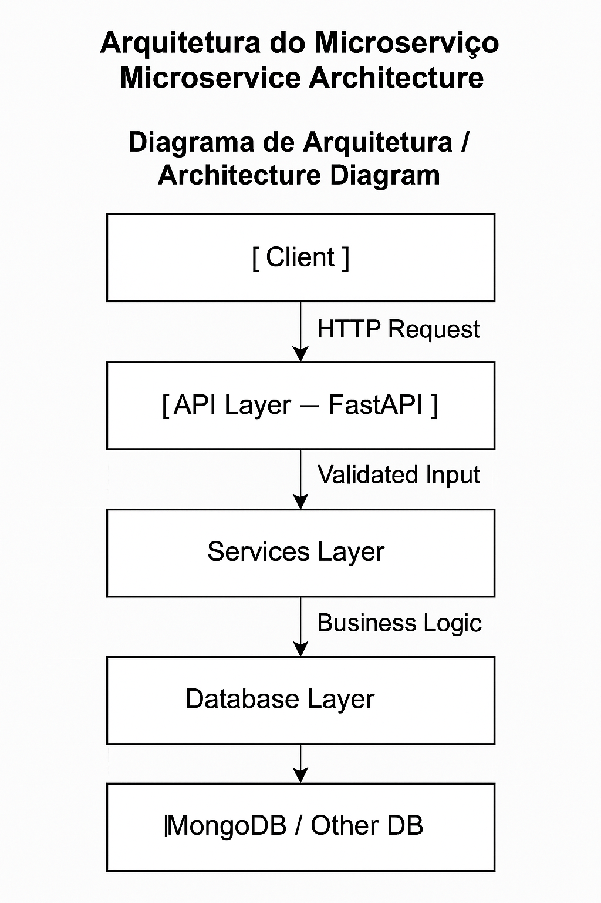

# Microservice Backend Challenge

This project implements a backend microservice capable of receiving, validating, and persisting JSON data via HTTP. It showcases modern backend practices using FastAPI, containerization with Docker, orchestration via Kubernetes, and automation with GitHub Actions.


## Overview

* **Language:** Python
* **Framework:** FastAPI
* **Database:** MongoDB (suggested)
* **Containerization:** Docker
* **Orchestration:** Kubernetes
* **CI/CD:** GitHub Actions
* **Python Version**: 3.9

---

## Documentation Overview

- [API](design/api.md)
- [Architecture](design/architecture.md)
- [Database](design/database.md)
- [Docker](design/docker.md)
- [Kubernetes](design/kubernetes.md)
- [CI/CD Pipeline](design/ci-cd.md)
- [Testing Strategy](design/testing.md)


## Architecture




### Layered Responsibilities

* **API Layer**: Handles HTTP requests, input validation and returns standardized responses.
* **Service Layer**: Contains the business logic, decouples API from persistence.
* **Database Layer**: Manages data access. Supports swapping databases with minimal impact.

---

## CI/CD Pipeline

Automated pipeline using **GitHub Actions** ([`.github/workflows/deploy.yaml`](.github/workflows/deploy.yaml)):

1. Code checkout and Python environment setup
2. Dependency installation with `pip`, including tools for testing and linting
3. Static code analysis with `ruff`
4. Unit tests with `pytest`
5. Building Docker image
6. Pushing image to GHCR
5. Deploying to Kubernetes 

---

## Kubernetes Configuration

YAML manifests provided:

* `deployment.yaml`
* `service.yaml`
* `configmap.yaml`
* `hpa.yaml`

All located in the `kubernetes` folder. Deployment configured for horizontal scaling using HPA.

---

## Docker

Dockerfile provided in the project root. Minimal FastAPI app with:

* `main.py`: defines `POST /data` and `GET /data` endpoints
* `requirements.txt`: FastAPI, Uvicorn

---

## Deployment

The CI/CD pipeline includes steps for building and pushing the Docker image, as well as applying Kubernetes manifests.

**Note:** For this design-focused challenge, the Kubernetes deployment step in the pipeline is mocked. The real deployment only runs if the `KUBECONFIG` secret is configured in the GitHub repository, which is not included here.

This approach allows the pipeline to complete successfully and simulate the deployment flow without requiring actual access to a Kubernetes cluster.

In production or full implementation scenarios, proper cluster access and secrets must be configured for automated deployment.

---

## Testing Strategy

This project includes initial unit tests and outlines a broader testing strategy to ensure API correctness and future scalability.

### Implemented Tests

* **API Tests**
  * Successful creation via `POST /data` using valid payload
  * Async test execution using `httpx` and `pytest-asyncio`

Tests are located in the [`/test`](./test/) directory and can be executed with:

```bash
pytest
```

Libraries to use:

* `pytest`
* `httpx`
* `pytest-asyncio`

---

## Code Quality

This project uses [Ruff](https://github.com/charliermarsh/ruff) as a static code analyzer to enforce code style, catch bugs early, and maintain high code quality.

Ruff is configured via the `.ruff.toml` file and runs automatically in the CI pipeline on every push and pull request.

In addition, automated tests are executed using `pytest` to verify application correctness and reliability.

Together, these tools help ensure the codebase remains clean, consistent, and robust before deployment.

---

## How to Run Locally

```bash
# Install dependencies
pip install -r requirements.txt

# Run API
uvicorn main:app --reload --host 0.0.0.0 --port 8000
```

---

## Deployment

**Requirements**:
- Docker installed
- Kubernetes cluster (local or remote)
- Secrets configured:
  - `KUBECONFIG` (cluster access)
  - `GITHUB_TOKEN` (for GHCR push)

Kubernetes manifests are located in `/kubernetes/` and ready to be applied.

---

## Future Improvements

* Add authentication and rate-limiting  
* Include observability stack (Prometheus + Grafana)  
* Enable GitHub Environments for PR approvals  
* Setup full test automation  
* Integrate Redis for caching and asynchronous task handling  

---

## Final Notes

This project simulates a production-ready microservice with best practices in API design, modular architecture, infrastructure as code, and CI/CD automation.
